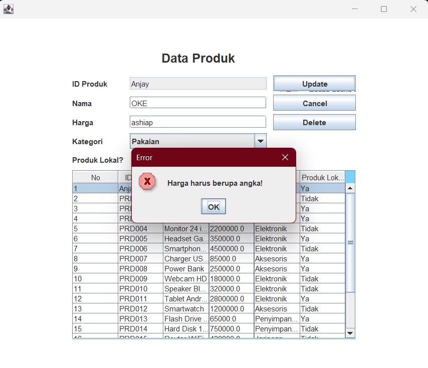

# 💻 TP5 DPBO - Imam Azizun Hakim - 2404420

## 🤝 Janji
"Saya Imam Azizun Hakim dengan NIM 2404420 mengerjakan Tugas Praktikum 5 dalam mata kuliah Desain Pemrograman Berorientasi Objek untuk keberkahan-Nya maka saya tidak akan melakukan kecurangan seperti yang telah di spesifikasikan. Aamiin."

## 🔀 Penjelasan Desain dan Kode Flow
- Menggunakan 1 class bernama **_Product_** dengan 5 atribut

### Diagram
  
  

### Class Product
- Atribut **_Product_** :
<pre>
  ● id         <strong>Id Produk berupa String dengan inputan JTextField</strong>
  ● nama       <strong>Nama Produk berupa String dengan inputan JTextField</strong>
  ● harga      <strong>Harga Produk berupa Double dengan inputan JTextField</strong>
  ● kategori   <strong>Kategori Produk berupa String dengan inputan JComboBox</strong>
  ● lokal      <strong>Apakah Produk buatan lokal? (boolean) dengan inputan JRadioButton</strong>
</pre>
- Method **_Product_** :
<pre>
  ● Constructor   <strong>Untuk membuat objek Product yang baru</strong>
  ● Getter        <strong>Mengambil nilai atribut</strong>
  ● Setter        <strong>Mengubah nilai atribut</strong>
</pre>
  
### Flow Program
<pre>
  1. Program dimulai dengan data awal (hardcode)
  2. Menampilkan data awal Produk
  3. Menambahkan data baru dengan atribut yang harus lengkap (ada Error Handling)
  5. Mengedit data dengan atribut yang harus lengkap (ada Error Handling)
  6. Menghapus data dengan confirmation prompt
</pre>

### Connect Database
Pada Tugas Praktikum kali ini, menggunakan tugas sebelumnya yaitu TP4 dengan beberpaa perubahan di bagian data. Kali ini data diambil dari database MySQL, tidak dari hardcode seperti pada TP4. Untuk CRUD sudah tersambung ke Database MySQL. File data ***product.sql*** terdapat pada lampiran.
 
### Requirements
- Hubungkan semua proses CRUD dengan database ✅
- Hapus penggunaan variabel ArrayList. (*) ✅
- Tampilkan dialog/prompt error jika masih ada kolom input yang kosong saat insert/update ✅
- Tampilkan dialog/prompt error jika sudah ada ID yang sama saat insert ✅
    
## 📝 Dokumentasi
**Berikut adalah Dokumentasi berupa Screenshot saat program dijalankan di IntelliJ IDEA**

### Tampilan Awal

### ERROR HANDLING INSERT

### INSERT

### ERROR HANDLING UPDATE

### UPDATE

### DELETE

