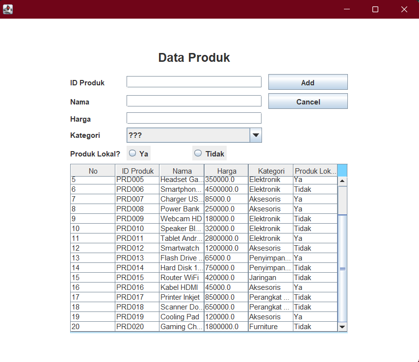

# 💻 TP4 DPBO - Imam Azizun Hakim - 2404420

## 🤝 Janji
"Saya Imam Azizun Hakim dengan NIM 2404420 mengerjakan Tugas Praktikum 4 dalam mata kuliah Desain Pemrograman Berorientasi Objek untuk keberkahan-Nya maka saya tidak akan melakukan kecurangan seperti yang telah di spesifikasikan. Aamiin."

## 🔀 Penjelasan Desain dan Kode Flow
- Menggunakan 1 class bernama **_Product_** dengan 5 atribut

### Diagram
  
  

### Class Product
- Atribut **_Product_** :
<pre>
  ● id         <strong>Id Produk berupa String dengan inputan JTextField</strong>
  ● nama       <strong>Nama Produk berupa String dengan inputan JTextField</strong>
  ● harga      <strong>Harga Produk berupa Double dengan inputan JTextField</strong>
  ● kategori   <strong>Kategori Produk berupa String dengan inputan JComboBox</strong>
  ● lokal      <strong>Apakah Produk buatan lokal? (boolean) dengan inputan JRadioButton</strong>
</pre>
- Method **_Product_** :
<pre>
  ● Constructor   <strong>Untuk membuat objek Product yang baru</strong>
  ● Getter        <strong>Mengambil nilai atribut</strong>
  ● Setter        <strong>Mengubah nilai atribut</strong>
</pre>
  
### Flow Program
<pre>
  1. Program dimulai dengan data awal (hardcode)
  2. Menampilkan data awal Produk
  3. Menambahkan data baru dengan atribut yang harus lengkap (ada Error Handling)
  5. Mengedit data dengan atribut yang harus lengkap (ada Error Handling)
  6. Menghaous data dengan confirmation prompt
</pre>
 
### Requirements
  - Ketik ulang code di atas untuk melengkapi file ProductMenu.java ✅
  - Tambahkan confirmation prompt sebelum delete ✅
  - Tambahkah satu atribut baru di class Product sekaligus component di form dan logika pada file ProductMenu.java ✅
  - Tambahan atribut produk lokal dengan inputan JRadioButton (Bonus) ✅
    
## 📝 Dokumentasi
**Berikut adalah Dokumentasi berupa Screenshot saat program dijalankan di IntelliJ IDEA**

### Tampilan Awal

### ERROR HANDLING INSERT

### INSERT

### ERROR HANDLING UPDATE

### UPDATE

### DELETE

